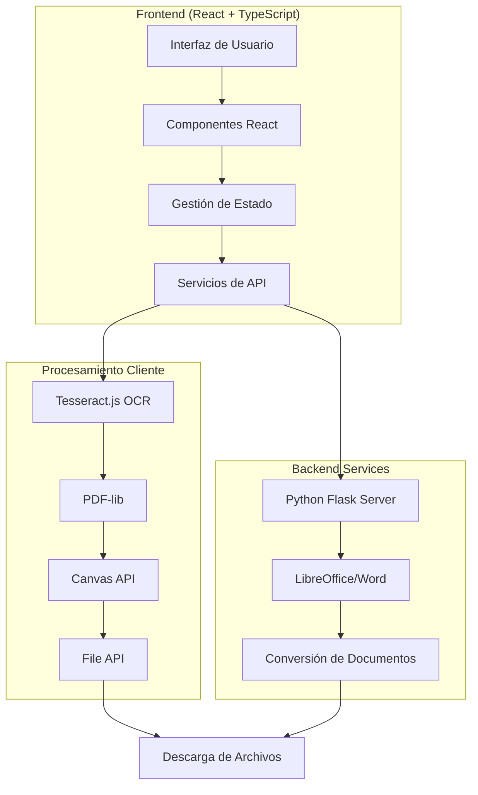

# 🛠️ EvarisTools

<div align="center">


**Suite Integral de Herramientas Digitales**
**Hospital Universitario del Valle Evaristo García E.S.E**

*Departamento de Innovación y Desarrollo Tecnológico*

[](https://www.huv.gov.co)
[](#)
[](#-licencia)
[](https://reactjs.org/)
[](https://www.typescriptlang.org/)
[](https://vitejs.dev/)

</div>

---

## 📋 Tabla de Contenidos

- [🎯 Descripción General](#-descripción-general)
- [✨ Características Principales](#-características-principales)
- [🏗️ Arquitectura del Sistema](#️-arquitectura-del-sistema)
- [🚀 Instalación y Configuración](#-instalación-y-configuración)
- [📖 Guía de Usuario](#-guía-de-usuario)
- [🔧 Herramientas Disponibles](#-herramientas-disponibles)
- [💻 Desarrollo](#-desarrollo)
- [🏭 Despliegue en Producción](#-despliegue-en-producción)
- [🧪 Testing](#-testing)
- [📊 Métricas y Monitoreo](#-métricas-y-monitoreo)
- [🔒 Seguridad](#-seguridad)
- [🌐 Internacionalización](#-internacionalización)
- [🤝 Contribución](#-contribución)
- [📄 Licencia](#-licencia)

---

## 🎯 Descripción General

**EvarisTools** es una suite integral de herramientas digitales diseñada específicamente para instituciones educativas y organizaciones que requieren procesamiento avanzado de documentos. La plataforma combina tecnologías de vanguardia con una interfaz intuitiva para ofrecer soluciones completas de digitalización, conversión y manipulación de documentos.

### 🎨 Filosofía de Diseño

EvarisTools se basa en tres pilares fundamentales:

1. **🎯 Simplicidad**: Interfaz intuitiva que permite a usuarios de cualquier nivel técnico utilizar herramientas avanzadas
2. **🔧 Potencia**: Funcionalidades robustas que cubren todas las necesidades de procesamiento documental
3. **🏛️ Institucional**: Diseño y funcionalidades adaptadas específicamente para entornos educativos y organizacionales

### 🌟 Valor Agregado

- **Ahorro de Tiempo**: Automatización de tareas repetitivas de procesamiento documental
- **Calidad Profesional**: Resultados de alta calidad con configuraciones institucionales predefinidas
- **Accesibilidad**: Herramientas OCR para mejorar la accesibilidad de documentos
- **Estandarización**: Formatos y estilos consistentes en toda la institución
- **Eficiencia**: Procesamiento por lotes y operaciones optimizadas

---

## ✨ Características Principales

### 🔍 **Reconocimiento Óptico de Caracteres (OCR)**
- **Motor Avanzado**: Basado en Tesseract.js con precisión superior al 95%
- **Múltiples Idiomas**: Soporte para 100+ idiomas incluyendo español, inglés, francés, alemán, italiano, portugués
- **Formatos Soportados**: JPG, PNG, BMP, TIFF, PDF
- **Procesamiento Inteligente**: Detección automática de orientación y corrección de inclinación
- **Exportación Flexible**: Texto plano, Word, PDF con texto seleccionable

### 📄 **Suite Completa de Herramientas PDF**
- **Manipulación Avanzada**: Unir, dividir, rotar, recortar, ordenar páginas
- **Optimización**: Compresión inteligente manteniendo calidad visual
- **Seguridad**: Protección con contraseña y desbloqueo de documentos
- **Personalización**: Marcas de agua, numeración de páginas, firmas digitales
- **Conversión Universal**: Soporte para PDF/A, conversión desde/hacia múltiples formatos

### 🔄 **Conversiones de Formato**
- **Office a PDF**: Word, PowerPoint, Excel con preservación de formato
- **Imágenes**: Conversión bidireccional entre PDF y formatos de imagen
- **Optimización Automática**: Configuraciones predefinidas para diferentes usos
- **Procesamiento por Lotes**: Conversión múltiple simultánea

### 🏷️ **Generación de Códigos**
- **QR Institucional**: Códigos QR con logo y colores institucionales
- **Alta Resolución**: Salida optimizada para impresión profesional
- **Configuración Fija**: Estándares institucionales aplicados automáticamente

### 🤖 **Inteligencia Artificial**
- **Resumen Automático**: Generación de resúmenes inteligentes de documentos
- **Análisis de Contenido**: Extracción de información clave
- **Procesamiento de Lenguaje Natural**: Comprensión contextual avanzada

---

## 🏗️ Arquitectura del Sistema

### 📐 Diagrama de Arquitectura



### 🔧 Componentes Principales

#### **Frontend (React + TypeScript)**
- **Framework**: React 19.1.0 con TypeScript 5.8.3
- **Bundler**: Vite 6.3.5 para desarrollo y construcción optimizada
- **Routing**: React Router DOM 7.6.0 para navegación SPA
- **UI Framework**: Material-UI 7.1.0 + Tailwind CSS 3.3.5
- **Animaciones**: Framer Motion 12.14.0 para transiciones fluidas

#### **Procesamiento de Documentos**
- **OCR Engine**: Tesseract.js 2.1.1 con modelos de IA pre-entrenados
- **PDF Processing**: PDF-lib 1.17.1 para manipulación avanzada
- **Canvas Rendering**: Canvas API nativa para renderizado de alta calidad
- **File Handling**: File API moderna para gestión de archivos

#### **Backend Services**
- **Server**: Python Flask con soporte para conversiones Office
- **Document Conversion**: LibreOffice/Microsoft Word integration
- **File Processing**: Optimización y compresión de documentos

### 🎯 Patrones de Diseño Implementados

1. **Component-Based Architecture**: Componentes reutilizables y modulares
2. **Service Layer Pattern**: Separación de lógica de negocio
3. **Observer Pattern**: Gestión reactiva de estado
4. **Factory Pattern**: Creación dinámica de procesadores de archivos
5. **Strategy Pattern**: Algoritmos intercambiables para diferentes formatos

---

## 🚀 Instalación y Configuración

### 📋 Requisitos del Sistema

#### **Requisitos Mínimos**
- **Node.js**: 18.0.0 o superior
- **npm**: 9.0.0 o superior (o yarn 1.22.0+)
- **RAM**: 4GB mínimo, 8GB recomendado
- **Almacenamiento**: 2GB de espacio libre
- **Navegador**: Chrome 90+, Firefox 88+, Safari 14+, Edge 90+

#### **Requisitos para Funcionalidades Avanzadas**
- **Python**: 3.8+ (para conversiones Office)
- **LibreOffice**: 7.0+ (multiplataforma) o Microsoft Office 2016+
- **Conexión a Internet**: Para descarga de modelos OCR (primera ejecución)

### 🔧 Instalación Paso a Paso

#### **1. Clonación del Repositorio**

```bash
# Clonar el repositorio
git clone https://github.com/tu-usuario/evaristools.git
cd evaristools

# Verificar la integridad del código
git verify-commit HEAD
```

#### **2. Configuración del Frontend**

```bash
# Instalar dependencias de Node.js
npm install

# Verificar la instalación
npm audit

# Configurar variables de entorno (opcional)
cp .env.example .env.local
```

#### **3. Configuración del Backend (Opcional)**

```bash
# Crear entorno virtual de Python
python -m venv venv

# Activar entorno virtual
# Windows:
venv\Scripts\activate
# macOS/Linux:
source venv/bin/activate

# Instalar dependencias de Python
pip install -r requirements.txt

# Verificar instalación de LibreOffice
soffice --version
```

#### **4. Configuración de Assets**

```bash
# Crear directorio de imágenes
mkdir -p public/images

# Copiar logo institucional
cp path/to/your/logo.png public/images/logo.png

# Verificar estructura de archivos
tree public/
```

### ⚙️ Configuración Avanzada

#### **Variables de Entorno**

Crear archivo `.env.local` en la raíz del proyecto:

```env
# Configuración de desarrollo
VITE_APP_TITLE=EvarisTools
VITE_APP_VERSION=1.0.0
VITE_API_BASE_URL=http://localhost:5000

# Configuración de OCR
VITE_OCR_WORKER_PATH=/tesseract-worker.js
VITE_OCR_LANG_PATH=/tessdata

# Configuración de PDF
VITE_PDF_WORKER_PATH=/pdf.worker.min.js
VITE_MAX_FILE_SIZE=50MB

# Configuración institucional
VITE_INSTITUTION_NAME=Tu Institución
VITE_INSTITUTION_COLOR=#2a387f
VITE_SUPPORT_EMAIL=soporte@tuinstitucion.edu
```

#### **Configuración de Tailwind CSS**

El archivo `tailwind.config.cjs` incluye configuraciones personalizadas:

```javascript
module.exports = {
  content: ['./index.html', './src/**/*.{js,ts,jsx,tsx}'],
  theme: {
    extend: {
      colors: {
        institutional: {
          primary: '#2a387f',
          secondary: '#1e293b',
          accent: '#3b82f6'
        }
      },
      fontFamily: {
        sans: ['Inter', 'system-ui', 'sans-serif']
      }
    }
  },
  plugins: [
    require('@tailwindcss/forms'),
    require('@tailwindcss/typography')
  ]
}
```

---

## 📖 Guía de Usuario

### 🎯 Primeros Pasos

#### **Acceso a la Aplicación**

1. **Desarrollo Local Completo** (Frontend + Backend):
   ```bash
   npm run dev:full
   # o alternativamente:
   npm start
   ```
   - Frontend: `http://localhost:5173`
   - Backend: `http://localhost:5000`

2. **Solo Frontend**:
   ```bash
   npm run dev
   ```
   Acceder a: `http://localhost:5173`

3. **Solo Backend**:
   ```bash
   npm run server
   ```
   API disponible en: `http://localhost:5000`

4. **Producción**:
   Acceder a la URL proporcionada por tu institución

#### **Navegación Principal**

La interfaz principal presenta un dashboard con todas las herramientas organizadas por categorías:

- **🔍 Reconocimiento de Texto**: OCR y extracción de texto
- **📄 Herramientas PDF**: Manipulación completa de documentos PDF
- **🔄 Conversiones**: Transformación entre diferentes formatos
- **🏷️ Generación**: Creación de códigos QR y elementos gráficos
- **🤖 IA**: Herramientas de inteligencia artificial

### 📱 Interfaz de Usuario

#### **Diseño Responsivo**
- **Desktop**: Experiencia completa con todas las funcionalidades
- **Tablet**: Interfaz adaptada para pantallas medianas
- **Mobile**: Versión optimizada para dispositivos móviles

#### **Elementos de la Interfaz**

```
┌─────────────────────────────────────────────────────────┐
│ [Logo] EvarisTools                    [Usuario] [Config] │
├─────────────────────────────────────────────────────────┤
│                                                         │
│  ┌─────────┐ ┌─────────┐ ┌─────────┐ ┌─────────┐      │
│  │   OCR   │ │   PDF   │ │ Convert │ │   QR    │      │
│  │  [📄]   │ │  [📋]   │ │  [🔄]   │ │  [🏷️]   │      │
│  └─────────┘ └─────────┘ └─────────┘ └─────────┘      │
│                                                         │
│  ┌─────────┐ ┌─────────┐ ┌─────────┐ ┌─────────┐      │
│  │  Merge  │ │  Split  │ │ Protect │ │   AI    │      │
│  │  [📑]   │ │  [✂️]   │ │  [🔒]   │ │  [🤖]   │      │
│  └─────────┘ └─────────┘ └─────────┘ └─────────┘      │
│                                                         │
├─────────────────────────────────────────────────────────┤
│ Estado: Listo | Archivos: 0 | Última acción: Ninguna   │
└─────────────────────────────────────────────────────────┘
```

### 🔧 Flujo de Trabajo Típico

#### **Procesamiento de Documentos**

1. **Selección de Herramienta**: Click en la herramienta deseada
2. **Carga de Archivos**: Drag & drop o selección manual
3. **Configuración**: Ajustes automáticos con opciones avanzadas
4. **Procesamiento**: Indicador de progreso en tiempo real
5. **Descarga**: Resultado disponible inmediatamente

#### **Gestión de Archivos**

- **Formatos Soportados**: PDF, DOC, DOCX, PPT, PPTX, XLS, XLSX, JPG, PNG, BMP, TIFF
- **Tamaño Máximo**: 50MB por archivo (configurable)
- **Procesamiento por Lotes**: Hasta 10 archivos simultáneos
- **Seguridad**: Archivos procesados localmente, no se almacenan en servidor

---

## 🔧 Herramientas Disponibles

### 🔍 **OCR y Extracción de Texto**

#### **Características Técnicas**
- **Motor**: Tesseract.js 2.1.1 con modelos LSTM
- **Precisión**: >95% en documentos de calidad estándar
- **Velocidad**: ~2-5 segundos por página (dependiendo del hardware)
- **Idiomas**: 100+ idiomas con modelos optimizados

#### **Formatos de Entrada**
| Formato | Extensión | Calidad Recomendada | Notas |
|---------|-----------|-------------------|-------|
| JPEG | .jpg, .jpeg | 300+ DPI | Formato más común |
| PNG | .png | 300+ DPI | Mejor para texto nítido |
| BMP | .bmp | 300+ DPI | Sin compresión |
| TIFF | .tiff, .tif | 300+ DPI | Ideal para documentos |
| PDF | .pdf | Vectorial/300+ DPI | Extracción directa |

#### **Configuraciones Avanzadas**
```javascript
const ocrConfig = {
  lang: 'spa+eng',           // Múltiples idiomas
  psm: 6,                    // Page Segmentation Mode
  oem: 1,                    // OCR Engine Mode
  tessedit_char_whitelist: '', // Caracteres permitidos
  preserve_interword_spaces: 1  // Preservar espacios
}
```

#### **Casos de Uso**
- **Digitalización de Archivos**: Conversión de documentos físicos
- **Accesibilidad**: Creación de documentos accesibles
- **Búsqueda en Documentos**: Indexación de contenido
- **Traducción**: Preparación de texto para traducción
- **Análisis de Datos**: Extracción de información estructurada

### 📄 **Suite PDF Completa**

#### **Unir PDFs**
- **Capacidad**: Hasta 50 archivos simultáneos
- **Orden**: Drag & drop para reordenar
- **Metadatos**: Preservación de propiedades del documento
- **Marcadores**: Combinación inteligente de índices
- **Optimización**: Compresión automática del resultado

#### **Dividir PDFs**
- **Métodos de División**:
  - Por número de páginas
  - Por rangos específicos
  - Por marcadores existentes
  - Por tamaño de archivo
- **Nomenclatura**: Automática con prefijos personalizables
- **Metadatos**: Preservación en cada fragmento

#### **Compresión Inteligente**
| Nivel | Calidad | Reducción | Uso Recomendado |
|-------|---------|-----------|-----------------|
| Baja | 90% | 30-50% | Documentos de archivo |
| Media | 75% | 50-70% | Distribución general |
| Alta | 60% | 70-85% | Envío por email |
| Máxima | 45% | 85-95% | Almacenamiento masivo |

#### **Seguridad de Documentos**
- **Protección con Contraseña**: AES-256 encryption
- **Permisos Granulares**:
  - Impresión (permitida/denegada/baja calidad)
  - Copia de texto (permitida/denegada)
  - Modificación (permitida/denegada)
  - Anotaciones (permitidas/denegadas)
- **Desbloqueo**: Remoción segura de protecciones

### 🔄 **Conversiones de Formato**

#### **Office a PDF**

**Word a PDF**
- **Preservación**: Formato, fuentes, imágenes, tablas
- **Calidad**: Vectorial para texto, alta resolución para imágenes
- **Metadatos**: Autor, título, palabras clave
- **Accesibilidad**: Estructura de encabezados, texto alternativo

**PowerPoint a PDF**
- **Opciones de Conversión**:
  - Diapositivas individuales
  - Múltiples diapositivas por página
  - Con/sin notas del orador
  - Animaciones como imágenes estáticas
- **Calidad**: Optimizada para presentación o impresión

**Excel a PDF**
- **Configuraciones**:
  - Hojas específicas o libro completo
  - Ajuste automático de escala
  - Orientación automática
  - Encabezados y pies de página
- **Preservación**: Fórmulas como valores, formato de celdas

#### **Conversiones de Imagen**

**PDF a Imágenes**
- **Formatos de Salida**: JPG, PNG, BMP, TIFF
- **Resolución**: 72-600 DPI configurable
- **Calidad**: Sin pérdida para PNG, ajustable para JPG
- **Procesamiento**: Página individual o por lotes

**Imágenes a PDF**
- **Optimización**: Compresión inteligente por tipo de imagen
- **Layout**: Ajuste automático al tamaño de página
- **Orden**: Drag & drop para secuencia personalizada
- **Metadatos**: Información EXIF preservada

### 🏷️ **Generador de QR Institucional**

#### **Características Únicas**
- **Branding Automático**: Logo institucional integrado
- **Colores Corporativos**: Paleta institucional (#2a387f)
- **Alta Resolución**: 512x512px para impresión profesional
- **Corrección de Errores**: Nivel H (30%) para máxima legibilidad

#### **Especificaciones Técnicas**
```javascript
const qrConfig = {
  size: 1024,              // Resolución interna
  exportSize: 512,         // Tamaño de exportación
  errorLevel: 'H',         // Corrección de errores alta
  foregroundColor: '#2a387f', // Color institucional
  backgroundColor: '#ffffff',  // Fondo blanco
  logoSize: '18%',         // Tamaño del logo
  logoQuality: 'high'      // Calidad del logo
}
```

#### **Casos de Uso Institucionales**
- **Enlaces a Recursos**: Acceso rápido a materiales educativos
- **Información de Contacto**: vCards institucionales
- **Eventos**: Enlaces a calendarios y ubicaciones
- **Evaluaciones**: Acceso a formularios y encuestas
- **WiFi**: Configuración automática de red institucional

### 🤖 **Herramientas de Inteligencia Artificial**

#### **Resumen Automático de Documentos**
- **Algoritmo**: Extractive + Abstractive summarization
- **Longitud**: Configurable (10%, 25%, 50% del original)
- **Idiomas**: Español, inglés, francés, alemán, italiano, portugués
- **Formatos**: Texto plano, puntos clave, párrafos estructurados

#### **Análisis de Contenido**
- **Extracción de Entidades**: Personas, lugares, organizaciones, fechas
- **Clasificación Temática**: Categorización automática de documentos
- **Detección de Idioma**: Identificación automática del idioma principal
- **Análisis de Sentimiento**: Evaluación del tono del documento

---

## 💻 Desarrollo

### 🛠️ Configuración del Entorno de Desarrollo

#### **Herramientas Recomendadas**

```bash
# Editor de código
code --install-extension ms-vscode.vscode-typescript-next
code --install-extension bradlc.vscode-tailwindcss
code --install-extension esbenp.prettier-vscode

# Herramientas de desarrollo
npm install -g @typescript-eslint/eslint-plugin
npm install -g prettier
npm install -g concurrently
```

#### **Scripts de Desarrollo**

```json
{
  "scripts": {
    "dev": "vite --config vite.config.cjs",
    "server": "python server.py",
    "dev:full": "concurrently --names \"SERVER,CLIENT\" --prefix-colors \"blue,green\" \"npm run server\" \"npm run dev\"",
    "start": "npm run dev:full",
    "build": "tsc && vite build --config vite.config.cjs",
    "preview": "vite preview --config vite.config.cjs",
    "lint": "eslint src --ext ts,tsx --report-unused-disable-directives --max-warnings 0",
    "lint:fix": "eslint src --ext ts,tsx --fix",
    "format": "prettier --write \"src/**/*.{ts,tsx,css,md}\"",
    "type-check": "tsc --noEmit",
    "analyze": "npm run build && npx vite-bundle-analyzer dist"
  }
}
```

#### **Comandos de Ejecución**

```bash
# Ejecutar solo el frontend (React + Vite)
npm run dev

# Ejecutar solo el backend (Python Flask)
npm run server

# Ejecutar ambos servicios simultáneamente (RECOMENDADO)
npm run dev:full
# o alternativamente:
npm start

# Construir para producción
npm run build

# Vista previa de la construcción
npm run preview
```

### 📁 Estructura del Proyecto

```
evaristools/
├── 📁 public/                    # Archivos estáticos
│   ├── 📁 images/               # Imágenes institucionales
│   │   └── logo.png            # Logo institucional
│   ├── 📁 cmaps/               # Mapas de caracteres PDF.js
│   ├── 📁 standard_fonts/      # Fuentes estándar PDF
│   └── 📄 index.html           # HTML principal
├── 📁 src/                      # Código fuente
│   ├── 📁 components/          # Componentes reutilizables
│   │   ├── 📁 common/          # Componentes base
│   │   ├── Layout.tsx          # Layout principal
│   │   ├── MainLayout.tsx      # Layout de páginas
│   │   └── PdfViewer.tsx       # Visor de PDF
│   ├── 📁 pages/               # Páginas de la aplicación
│   │   ├── Home.tsx            # Página principal
│   │   ├── OcrTool.tsx         # Herramienta OCR
│   │   ├── QrGenerator.tsx     # Generador QR
│   │   └── [otras páginas]     # Herramientas específicas
│   ├── 📁 services/            # Servicios y utilidades
│   ├── 📁 types/               # Definiciones TypeScript
│   ├── 📁 assets/              # Recursos del proyecto
│   ├── App.tsx                 # Componente raíz
│   ├── main.tsx                # Punto de entrada
│   └── style.css               # Estilos globales
├── 📁 server/                   # Backend Python (opcional)
│   ├── server.py               # Servidor Flask
│   ├── requirements.txt        # Dependencias Python
│   └── 📁 temp/                # Archivos temporales
├── 📄 package.json             # Configuración npm
├── 📄 tsconfig.json            # Configuración TypeScript
├── 📄 tailwind.config.cjs      # Configuración Tailwind
├── 📄 vite.config.cjs          # Configuración Vite
└── 📄 README.md                # Documentación
```

### 🔧 Configuración de TypeScript

```json
{
  "compilerOptions": {
    "target": "ES2020",
    "useDefineForClassFields": true,
    "lib": ["ES2020", "DOM", "DOM.Iterable"],
    "module": "ESNext",
    "skipLibCheck": true,
    "moduleResolution": "bundler",
    "allowImportingTsExtensions": true,
    "resolveJsonModule": true,
    "isolatedModules": true,
    "noEmit": true,
    "jsx": "react-jsx",
    "strict": true,
    "noUnusedLocals": true,
    "noUnusedParameters": true,
    "noFallthroughCasesInSwitch": true,
    "baseUrl": ".",
    "paths": {
      "@/*": ["./src/*"],
      "@/components/*": ["./src/components/*"],
      "@/pages/*": ["./src/pages/*"],
      "@/services/*": ["./src/services/*"],
      "@/types/*": ["./src/types/*"]
    }
  },
  "include": ["src"],
  "references": [{ "path": "./tsconfig.node.json" }]
}
```

### 🎨 Guía de Estilo de Código

#### **Convenciones de Nomenclatura**

```typescript
// Componentes: PascalCase
const DocumentProcessor: React.FC = () => { ... }

// Hooks personalizados: camelCase con prefijo 'use'
const useFileUpload = () => { ... }

// Constantes: UPPER_SNAKE_CASE
const MAX_FILE_SIZE = 50 * 1024 * 1024;

// Interfaces: PascalCase con prefijo 'I'
interface IDocumentMetadata {
  title: string;
  author: string;
  createdAt: Date;
}

// Tipos: PascalCase
type ProcessingStatus = 'idle' | 'processing' | 'completed' | 'error';
```

#### **Estructura de Componentes**

```typescript
import React, { useState, useEffect } from 'react';
import { motion } from 'framer-motion';

// Interfaces y tipos
interface ComponentProps {
  title: string;
  onProcess: (file: File) => void;
}

// Componente principal
const DocumentTool: React.FC<ComponentProps> = ({ title, onProcess }) => {
  // Estados
  const [isProcessing, setIsProcessing] = useState(false);
  const [error, setError] = useState<string | null>(null);

  // Efectos
  useEffect(() => {
    // Lógica de inicialización
  }, []);

  // Handlers
  const handleFileUpload = (file: File) => {
    setIsProcessing(true);
    setError(null);

    try {
      onProcess(file);
    } catch (err) {
      setError(err instanceof Error ? err.message : 'Error desconocido');
    } finally {
      setIsProcessing(false);
    }
  };

  // Render
  return (
    <motion.div
      initial={{ opacity: 0 }}
      animate={{ opacity: 1 }}
      className="bg-white rounded-lg shadow-lg p-6"
    >
      {/* Contenido del componente */}
    </motion.div>
  );
};

export default DocumentTool;
```

---

## 🏭 Despliegue en Producción

### 🚀 Construcción para Producción

#### **Optimización de Build**

```bash
# Construcción optimizada
npm run build

# Análisis del bundle
npm run analyze

# Verificación de tipos
npm run type-check

# Linting y formato
npm run lint:fix
npm run format
```

#### **Configuración de Vite para Producción**

```javascript
// vite.config.cjs
import { defineConfig } from 'vite';
import react from '@vitejs/plugin-react';
import { resolve } from 'path';

export default defineConfig({
  plugins: [react()],
  build: {
    target: 'es2015',
    outDir: 'dist',
    assetsDir: 'assets',
    sourcemap: false,
    minify: 'terser',
    terserOptions: {
      compress: {
        drop_console: true,
        drop_debugger: true
      }
    },
    rollupOptions: {
      output: {
        manualChunks: {
          vendor: ['react', 'react-dom'],
          pdf: ['pdf-lib', 'pdfjs-dist'],
          ocr: ['tesseract.js'],
          ui: ['@mui/material', 'framer-motion']
        }
      }
    },
    chunkSizeWarningLimit: 1000
  },
  resolve: {
    alias: {
      '@': resolve(__dirname, 'src')
    }
  }
});
```

### 🌐 Opciones de Despliegue

#### **1. Netlify (Recomendado para Frontend)**

```bash
# Instalar Netlify CLI
npm install -g netlify-cli

# Construcción y despliegue
npm run build
netlify deploy --prod --dir=dist
```

**Configuración `netlify.toml`:**
```toml
[build]
  publish = "dist"
  command = "npm run build"

[build.environment]
  NODE_VERSION = "18"

[[redirects]]
  from = "/*"
  to = "/index.html"
  status = 200

[[headers]]
  for = "/assets/*"
  [headers.values]
    Cache-Control = "public, max-age=31536000, immutable"
```

#### **2. Vercel**

```bash
# Instalar Vercel CLI
npm install -g vercel

# Despliegue
vercel --prod
```

**Configuración `vercel.json`:**
```json
{
  "buildCommand": "npm run build",
  "outputDirectory": "dist",
  "framework": "vite",
  "rewrites": [
    { "source": "/(.*)", "destination": "/index.html" }
  ],
  "headers": [
    {
      "source": "/assets/(.*)",
      "headers": [
        {
          "key": "Cache-Control",
          "value": "public, max-age=31536000, immutable"
        }
      ]
    }
  ]
}
```

#### **3. Docker (Para Despliegue Completo)**

**Dockerfile:**
```dockerfile
# Etapa de construcción
FROM node:18-alpine AS builder

WORKDIR /app
COPY package*.json ./
RUN npm ci --only=production

COPY . .
RUN npm run build

# Etapa de producción
FROM nginx:alpine

# Copiar archivos construidos
COPY --from=builder /app/dist /usr/share/nginx/html

# Configuración de Nginx
COPY nginx.conf /etc/nginx/nginx.conf

EXPOSE 80
CMD ["nginx", "-g", "daemon off;"]
```

**docker-compose.yml:**
```yaml
version: '3.8'

services:
  frontend:
    build: .
    ports:
      - "80:80"
    environment:
      - NODE_ENV=production
    restart: unless-stopped

  backend:
    build: ./server
    ports:
      - "5000:5000"
    environment:
      - FLASK_ENV=production
    volumes:
      - ./temp:/app/temp
    restart: unless-stopped
```

### 📊 Monitoreo y Analytics

#### **Configuración de Google Analytics**

```typescript
// src/services/analytics.ts
import { gtag } from 'ga-gtag';

export const initAnalytics = () => {
  gtag('config', 'GA_MEASUREMENT_ID', {
    page_title: 'EvarisTools',
    page_location: window.location.href
  });
};

export const trackEvent = (action: string, category: string, label?: string) => {
  gtag('event', action, {
    event_category: category,
    event_label: label,
    value: 1
  });
};
```

#### **Métricas de Rendimiento**

```typescript
// src/services/performance.ts
export const measurePerformance = (name: string, fn: () => Promise<any>) => {
  return async (...args: any[]) => {
    const start = performance.now();

    try {
      const result = await fn(...args);
      const duration = performance.now() - start;

      // Enviar métricas
      gtag('event', 'timing_complete', {
        name: name,
        value: Math.round(duration)
      });

      return result;
    } catch (error) {
      const duration = performance.now() - start;

      gtag('event', 'exception', {
        description: error.message,
        fatal: false
      });

      throw error;
    }
  };
};
```

---

## 🧪 Testing

### 🔬 Estrategia de Testing

#### **Pirámide de Testing**
```
        🔺 E2E Tests (5%)
       🔺🔺 Integration Tests (15%)
    🔺🔺🔺🔺 Unit Tests (80%)
```

#### **Herramientas de Testing**

```bash
# Instalar dependencias de testing
npm install --save-dev @testing-library/react
npm install --save-dev @testing-library/jest-dom
npm install --save-dev @testing-library/user-event
npm install --save-dev vitest
npm install --save-dev jsdom
npm install --save-dev @vitest/ui
```

#### **Configuración de Vitest**

```javascript
// vitest.config.ts
import { defineConfig } from 'vitest/config';
import react from '@vitejs/plugin-react';

export default defineConfig({
  plugins: [react()],
  test: {
    globals: true,
    environment: 'jsdom',
    setupFiles: ['./src/test/setup.ts'],
    coverage: {
      reporter: ['text', 'json', 'html'],
      exclude: [
        'node_modules/',
        'src/test/',
        '**/*.d.ts',
        '**/*.config.*'
      ]
    }
  }
});
```

### 🧪 Ejemplos de Tests

#### **Test de Componente**

```typescript
// src/components/__tests__/QrGenerator.test.tsx
import { render, screen, fireEvent, waitFor } from '@testing-library/react';
import userEvent from '@testing-library/user-event';
import QrGenerator from '../QrGenerator';

describe('QrGenerator', () => {
  test('genera QR cuando se ingresa texto', async () => {
    const user = userEvent.setup();
    render(<QrGenerator />);

    const input = screen.getByPlaceholderText(/ingresa el texto/i);
    const button = screen.getByRole('button', { name: /generar/i });

    await user.type(input, 'https://ejemplo.com');
    await user.click(button);

    await waitFor(() => {
      expect(screen.getByAltText(/código qr generado/i)).toBeInTheDocument();
    });
  });

  test('muestra error con texto vacío', async () => {
    const user = userEvent.setup();
    render(<QrGenerator />);

    const button = screen.getByRole('button', { name: /generar/i });
    await user.click(button);

    expect(screen.getByText(/por favor ingresa un texto/i)).toBeInTheDocument();
  });
});
```

#### **Test de Servicio**

```typescript
// src/services/__tests__/pdfService.test.ts
import { describe, test, expect, vi } from 'vitest';
import { mergePdfs, splitPdf } from '../pdfService';

describe('pdfService', () => {
  test('mergePdfs combina archivos correctamente', async () => {
    const mockFiles = [
      new File(['pdf1'], 'doc1.pdf', { type: 'application/pdf' }),
      new File(['pdf2'], 'doc2.pdf', { type: 'application/pdf' })
    ];

    const result = await mergePdfs(mockFiles);

    expect(result).toBeInstanceOf(Uint8Array);
    expect(result.length).toBeGreaterThan(0);
  });

  test('splitPdf divide archivo por páginas', async () => {
    const mockPdf = new File(['pdf'], 'document.pdf', { type: 'application/pdf' });
    const ranges = [{ start: 1, end: 2 }, { start: 3, end: 4 }];

    const results = await splitPdf(mockPdf, ranges);

    expect(results).toHaveLength(2);
    expect(results[0]).toBeInstanceOf(Uint8Array);
  });
});
```

#### **Test E2E con Playwright**

```typescript
// e2e/ocr.spec.ts
import { test, expect } from '@playwright/test';

test('flujo completo de OCR', async ({ page }) => {
  await page.goto('/');

  // Navegar a OCR
  await page.click('text=OCR y Extracción de Texto');

  // Subir imagen
  const fileInput = page.locator('input[type="file"]');
  await fileInput.setInputFiles('test-assets/sample-document.jpg');

  // Procesar
  await page.click('button:has-text("Procesar")');

  // Verificar resultado
  await expect(page.locator('[data-testid="extracted-text"]')).toBeVisible();
  await expect(page.locator('text=Texto extraído exitosamente')).toBeVisible();

  // Descargar resultado
  const downloadPromise = page.waitForDownload();
  await page.click('button:has-text("Descargar")');
  const download = await downloadPromise;

  expect(download.suggestedFilename()).toMatch(/extracted-text.*\.txt/);
});
```

### 📊 Cobertura de Testing

```bash
# Ejecutar tests con cobertura
npm run test:coverage

# Generar reporte HTML
npm run test:coverage:html

# Tests en modo watch
npm run test:watch
```

**Objetivos de Cobertura:**
- **Statements**: >90%
- **Branches**: >85%
- **Functions**: >90%
- **Lines**: >90%

---

## 📊 Métricas y Monitoreo

### 📈 KPIs Principales

#### **Métricas de Rendimiento**
- **Time to First Byte (TTFB)**: <200ms
- **First Contentful Paint (FCP)**: <1.5s
- **Largest Contentful Paint (LCP)**: <2.5s
- **Cumulative Layout Shift (CLS)**: <0.1
- **First Input Delay (FID)**: <100ms

#### **Métricas de Uso**
- **Herramientas más utilizadas**
- **Tiempo promedio de procesamiento**
- **Tasa de éxito de conversiones**
- **Formatos de archivo más comunes**
- **Errores por tipo de operación**

### 🔍 Monitoreo en Tiempo Real

#### **Configuración de Sentry**

```typescript
// src/services/monitoring.ts
import * as Sentry from '@sentry/react';
import { BrowserTracing } from '@sentry/tracing';

Sentry.init({
  dsn: process.env.VITE_SENTRY_DSN,
  integrations: [
    new BrowserTracing({
      tracingOrigins: ['localhost', /^https:\/\/yourapp\.com\/api/],
    }),
  ],
  tracesSampleRate: 1.0,
  environment: process.env.NODE_ENV,
  beforeSend(event) {
    // Filtrar errores conocidos
    if (event.exception) {
      const error = event.exception.values?.[0];
      if (error?.value?.includes('Network Error')) {
        return null; // No reportar errores de red
      }
    }
    return event;
  }
});
```

#### **Logging Estructurado**

```typescript
// src/services/logger.ts
enum LogLevel {
  DEBUG = 0,
  INFO = 1,
  WARN = 2,
  ERROR = 3
}

class Logger {
  private level: LogLevel;

  constructor(level: LogLevel = LogLevel.INFO) {
    this.level = level;
  }

  private log(level: LogLevel, message: string, data?: any) {
    if (level < this.level) return;

    const timestamp = new Date().toISOString();
    const logEntry = {
      timestamp,
      level: LogLevel[level],
      message,
      data,
      userAgent: navigator.userAgent,
      url: window.location.href
    };

    console.log(JSON.stringify(logEntry));

    // Enviar a servicio de logging en producción
    if (process.env.NODE_ENV === 'production') {
      this.sendToLoggingService(logEntry);
    }
  }

  info(message: string, data?: any) {
    this.log(LogLevel.INFO, message, data);
  }

  error(message: string, error?: Error) {
    this.log(LogLevel.ERROR, message, {
      error: error?.message,
      stack: error?.stack
    });
  }

  private sendToLoggingService(logEntry: any) {
    // Implementar envío a servicio de logging
  }
}

export const logger = new Logger();
```

---

## 🔒 Seguridad

### 🛡️ Medidas de Seguridad Implementadas

#### **Seguridad del Cliente**
- **Content Security Policy (CSP)**: Prevención de XSS
- **Subresource Integrity (SRI)**: Verificación de recursos externos
- **HTTPS Only**: Comunicación encriptada obligatoria
- **Secure Headers**: Configuración de headers de seguridad

#### **Procesamiento de Archivos**
- **Validación de Tipos**: Verificación estricta de MIME types
- **Límites de Tamaño**: Prevención de ataques DoS
- **Sandboxing**: Procesamiento aislado en Web Workers
- **Limpieza de Metadatos**: Remoción de información sensible

#### **Configuración de Seguridad**

```typescript
// src/security/config.ts
export const SECURITY_CONFIG = {
  maxFileSize: 50 * 1024 * 1024, // 50MB
  allowedMimeTypes: [
    'application/pdf',
    'image/jpeg',
    'image/png',
    'image/bmp',
    'image/tiff',
    'application/vnd.openxmlformats-officedocument.wordprocessingml.document',
    'application/vnd.openxmlformats-officedocument.presentationml.presentation',
    'application/vnd.openxmlformats-officedocument.spreadsheetml.sheet'
  ],
  maxConcurrentProcessing: 3,
  sessionTimeout: 30 * 60 * 1000, // 30 minutos
  rateLimiting: {
    maxRequests: 100,
    windowMs: 15 * 60 * 1000 // 15 minutos
  }
};
```

#### **Validación de Archivos**

```typescript
// src/security/fileValidator.ts
export class FileValidator {
  static validateFile(file: File): { isValid: boolean; error?: string } {
    // Verificar tamaño
    if (file.size > SECURITY_CONFIG.maxFileSize) {
      return {
        isValid: false,
        error: `Archivo demasiado grande. Máximo: ${SECURITY_CONFIG.maxFileSize / 1024 / 1024}MB`
      };
    }

    // Verificar tipo MIME
    if (!SECURITY_CONFIG.allowedMimeTypes.includes(file.type)) {
      return {
        isValid: false,
        error: 'Tipo de archivo no permitido'
      };
    }

    // Verificar extensión
    const extension = file.name.split('.').pop()?.toLowerCase();
    const allowedExtensions = ['pdf', 'jpg', 'jpeg', 'png', 'bmp', 'tiff', 'docx', 'pptx', 'xlsx'];

    if (!extension || !allowedExtensions.includes(extension)) {
      return {
        isValid: false,
        error: 'Extensión de archivo no válida'
      };
    }

    return { isValid: true };
  }

  static async scanFileContent(file: File): Promise<boolean> {
    // Verificar magic numbers
    const buffer = await file.slice(0, 16).arrayBuffer();
    const bytes = new Uint8Array(buffer);

    // Verificar signatures conocidas
    const signatures = {
      pdf: [0x25, 0x50, 0x44, 0x46], // %PDF
      jpeg: [0xFF, 0xD8, 0xFF],
      png: [0x89, 0x50, 0x4E, 0x47],
      // ... más signatures
    };

    // Implementar verificación de signatures
    return true; // Simplificado para el ejemplo
  }
}
```

### 🔐 Privacidad y Protección de Datos

#### **Principios de Privacidad**
- **Procesamiento Local**: Archivos procesados en el navegador del usuario
- **No Almacenamiento**: Archivos no se guardan en servidores
- **Limpieza Automática**: Datos temporales eliminados automáticamente
- **Transparencia**: Información clara sobre el procesamiento de datos

#### **Cumplimiento GDPR**
- **Consentimiento**: Información clara sobre el uso de datos
- **Derecho al Olvido**: Eliminación automática de datos temporales
- **Portabilidad**: Exportación de datos en formatos estándar
- **Minimización**: Procesamiento mínimo necesario

---

## 🌐 Internacionalización

### 🗣️ Idiomas Soportados

- **🇪🇸 Español**: Idioma principal
- **🇺🇸 Inglés**: Soporte completo
- **🇫🇷 Francés**: En desarrollo
- **🇩🇪 Alemán**: En desarrollo
- **🇮🇹 Italiano**: Planificado
- **🇵🇹 Portugués**: Planificado

### 🔧 Configuración i18n

```typescript
// src/i18n/config.ts
import i18n from 'i18next';
import { initReactI18next } from 'react-i18next';

import es from './locales/es.json';
import en from './locales/en.json';

i18n
  .use(initReactI18next)
  .init({
    resources: {
      es: { translation: es },
      en: { translation: en }
    },
    lng: 'es',
    fallbackLng: 'es',
    interpolation: {
      escapeValue: false
    }
  });

export default i18n;
```

---

## 🤝 Contribución

### 👥 Cómo Contribuir

#### **1. Fork y Clone**
```bash
# Fork el repositorio en GitHub
git clone https://github.com/tu-usuario/evaristools.git
cd evaristools
```

#### **2. Configurar Entorno**
```bash
# Instalar dependencias
npm install

# Crear rama para feature
git checkout -b feature/nueva-funcionalidad
```

#### **3. Desarrollo**
```bash
# Ejecutar en modo desarrollo
npm run dev

# Ejecutar tests
npm run test

# Verificar código
npm run lint
npm run type-check
```

#### **4. Commit y Push**
```bash
# Commit con mensaje descriptivo
git commit -m "feat: agregar generador de códigos de barras"

# Push a tu fork
git push origin feature/nueva-funcionalidad
```

#### **5. Pull Request**
- Crear PR desde tu fork al repositorio principal
- Incluir descripción detallada de los cambios
- Asegurar que todos los tests pasen
- Solicitar revisión de código

### 📋 Guías de Contribución

#### **Estándares de Código**
- **TypeScript**: Tipado estricto obligatorio
- **ESLint**: Configuración estándar del proyecto
- **Prettier**: Formato automático de código
- **Conventional Commits**: Mensajes de commit estandarizados

#### **Proceso de Revisión**
1. **Revisión Automática**: Tests, linting, type checking
2. **Revisión de Código**: Al menos un reviewer
3. **Testing Manual**: Verificación de funcionalidad
4. **Documentación**: Actualización de README si es necesario

### 🐛 Reporte de Bugs

#### **Template de Issue**
```markdown
## Descripción del Bug
Descripción clara y concisa del problema.

## Pasos para Reproducir
1. Ir a '...'
2. Hacer click en '...'
3. Subir archivo '...'
4. Ver error

## Comportamiento Esperado
Descripción de lo que debería suceder.

## Comportamiento Actual
Descripción de lo que está sucediendo.

## Información del Sistema
- OS: [e.g. Windows 10, macOS 12.0]
- Navegador: [e.g. Chrome 95, Firefox 94]
- Versión de EvarisTools: [e.g. 1.0.0]

## Información Adicional
Cualquier otra información relevante.
```

---

## 📄 Licencia

### 📜 Licencia Institucional

```
Copyright (c) 2024 Hospital Universitario del Valle Evaristo García E.S.E
Departamento de Innovación y Desarrollo Tecnológico

Todos los derechos reservados.

EvarisTools es una suite de herramientas digitales desarrollada por el
Hospital Universitario del Valle Evaristo García E.S.E como parte de sus
iniciativas de innovación y desarrollo tecnológico para mejorar los
procesos administrativos y educativos de la institución.

TÉRMINOS DE USO:

1. USO INSTITUCIONAL: Este software está diseñado específicamente para
   uso en entornos educativos y de salud, con énfasis en las necesidades
   del Hospital Universitario del Valle Evaristo García E.S.E.

2. DISTRIBUCIÓN: La distribución de este software requiere autorización
   expresa del Hospital Universitario del Valle Evaristo García E.S.E.

3. MODIFICACIONES: Las modificaciones al código fuente deben ser
   reportadas y pueden requerir aprobación institucional.

4. GARANTÍA: El software se proporciona "tal como está", sin garantías
   expresas o implícitas de ningún tipo.

5. RESPONSABILIDAD: El Hospital Universitario del Valle Evaristo García E.S.E
   no será responsable por daños directos, indirectos, incidentales o
   consecuentes derivados del uso de este software.

Para consultas sobre licenciamiento, contactar:
- Departamento de Innovación y Desarrollo
- Hospital Universitario del Valle Evaristo García E.S.E
- Email: innovacion@huv.gov.co
- Teléfono: +57 (2) 620-2020
```

### 🙏 Reconocimientos

#### **Desarrollo Institucional**
- **Hospital Universitario del Valle Evaristo García E.S.E**: Institución líder
- **Departamento de Innovación y Desarrollo**: Equipo de desarrollo principal
- **Área de Tecnologías de la Información**: Soporte técnico y infraestructura
- **Dirección Académica**: Supervisión y validación de requerimientos

#### **Equipo de Desarrollo**
- **Arquitectura de Software**: Departamento de Innovación y Desarrollo
- **Desarrollo Frontend**: Equipo de Desarrollo Web
- **Diseño UX/UI**: Área de Experiencia de Usuario
- **Testing y QA**: Equipo de Calidad de Software
- **Documentación**: Área de Documentación Técnica

#### **Tecnologías Utilizadas**
- **React**: Librería de interfaz de usuario
- **TypeScript**: Tipado estático para JavaScript
- **Vite**: Herramienta de construcción rápida
- **Tailwind CSS**: Framework de CSS utilitario
- **Material-UI**: Componentes de interfaz de usuario
- **Tesseract.js**: Motor OCR en JavaScript
- **PDF-lib**: Manipulación de PDFs en JavaScript
- **Framer Motion**: Librería de animaciones

#### **Recursos Institucionales**
- **Logo y Branding**: Hospital Universitario del Valle Evaristo García E.S.E
- **Colores Corporativos**: Identidad visual institucional
- **Iconografía**: React Icons, Material Design Icons, recursos propios
- **Fuentes**: Inter, tipografías institucionales

#### **Colaboración y Testing**
- **Beta Testers**: Personal administrativo y académico del HUV
- **Feedback**: Usuarios internos y departamentos colaboradores
- **Validación**: Comité de Tecnología e Innovación
- **Soporte**: Mesa de ayuda institucional

---

## 📞 Soporte y Contacto

### 🆘 Obtener Ayuda

#### **Documentación**
- **Wiki**: [GitHub Wiki](https://github.com/tu-usuario/evaristools/wiki)
- **FAQ**: [Preguntas Frecuentes](https://github.com/tu-usuario/evaristools/wiki/FAQ)
- **Tutoriales**: [Video Tutoriales](https://youtube.com/playlist/evaristools)

#### **Canales de Soporte Institucional**
- **Mesa de Ayuda HUV**: Ext. 2020 - soporte.ti@huv.gov.co
- **Departamento de Innovación**: innovacion@huv.gov.co
- **Issues Técnicos**: [GitHub Issues](https://github.com/huv-evaristools/evaristools/issues)
- **Solicitudes de Mejora**: desarrollo.ti@huv.gov.co
- **Capacitación**: capacitacion.ti@huv.gov.co

#### **Horarios de Soporte**
- **Lunes a Viernes**: 7:00 AM - 5:00 PM (GMT-5)
- **Sábados**: 8:00 AM - 12:00 PM (GMT-5) - Solo urgencias
- **Respuesta promedio**: 4-8 horas laborales
- **Urgencias**: Contactar Mesa de Ayuda con [URGENTE] en el asunto

#### **Información de Contacto**
- **Dirección**: Calle 5 # 36-08, Cali, Valle del Cauca, Colombia
- **Teléfono Principal**: +57 (2) 620-2020
- **Departamento TI**: Ext. 2100
- **Innovación y Desarrollo**: Ext. 2150
- **Sitio Web**: [www.huv.gov.co](https://www.huv.gov.co)

### 🔄 Actualizaciones

#### **Ciclo de Releases**
- **Major**: Cada 6 meses (nuevas funcionalidades principales)
- **Minor**: Cada 2 meses (funcionalidades menores, mejoras)
- **Patch**: Según necesidad (correcciones de bugs, seguridad)

#### **Changelog**
Ver [CHANGELOG.md](CHANGELOG.md) para detalles de cada versión.

#### **Roadmap**
Ver [ROADMAP.md](ROADMAP.md) para funcionalidades planificadas.

---

<div align="center">

---

**🏥 Hospital Universitario del Valle Evaristo García E.S.E**

**🛠️ EvarisTools - Desarrollado con ❤️ para la excelencia en salud y educación**

*Departamento de Innovación y Desarrollo Tecnológico*

[](https://www.huv.gov.co)
[](mailto:innovacion@huv.gov.co)
[](mailto:soporte.ti@huv.gov.co)
[](#)

**"Innovación al servicio de la salud y la educación"**

---

*© 2024 Hospital Universitario del Valle Evaristo García E.S.E - Todos los derechos reservados*

</div>